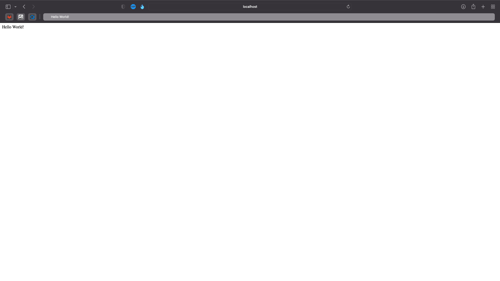

# Dockerized nodejs expressjs app with dockerized postgresql using sequelize
## Table of contents
* [1. Prerequisites](#1-prerequisites)
* [2. Web server](#2-web-server)
* [3. Database](#3-database)

### _For this guide I will be using **node-docker** as the project root directory_

## 1. Prerequisites
* [NodeJS](https://nodejs.org/en/)
* [Docker](https://www.docker.com/get-started)

## 2. Web server

1. Make a new project folder
```shell
mkdir node-docker
```

2. Initialize npm
```shell
npm init
```

3. Install dependencies:
* express - For web server
* dotenv - For project local environment variables (Database password etc.)
* pg - PostgreSQL
* pg-hstore - Utility package for serializing and deserializing JSON data to hstore format
* sequelize - ORM for NodeJS with builtin PostgreSQL support
```shell
npm install express dotenv pg pg-hstore sequelize
```

4. Create a file called index.js in your project root directory and open it
#### ___index.js___
```js
const express = require('express'); // Import the express package
require('dotenv').config(); // Import all the local environment variables stored in '.env'

const app = express(); // Initialize the express app

app.use(express.static('./public')); // Make all the files in the directory called 'public' accessible through the web server

app.listen(80, () => console.info('Listening on http://localhost')); // Make the web server listen on specified port
```

5. Now make a directory called 'public' and copy all your web files over there (HTML, JavaScript, CSS, etc.)

6. Create a Dockerfile and open it
#### ___Dockerfile___
```Dockerfile
# We want to use the node docker image to import all the necessary commands
FROM node:14

# We set the workdir to '/usr/src/app' meaning all of our files will be copied to here inside of the docker container
WORKDIR /usr/src/app

# Copy over the package.json and package-lock.json to define our dependencies for the project
COPY package*.json ./

# Install all the dependencies
RUN npm install

# Copy over the rest of the files in the project
COPY . .

# Expose the port 80 so that we can access the web server locally on our computer
EXPOSE 80

# Run 'node index.js' to start the web server
CMD [ "node", "index.js" ]
```

7. We also want a '.dockerignore' file to make sure we do not copy over the 'node_modules' directory because that directory can become quite large and take a long time to copy over, and we also install the dependencies inside of the container making it unnecessary to copy them over.
#### ___.dockerignore___
```.dockerignore
node_modules/
```

8. Now if we start the application with either:
```shell
node index.js
```
or
```shell
docker build -t node-docker-server .
docker run -d -p 80:80 node-docker-server
```

9. We should now be able to access the website by visiting [http://localhost](http://localhost)



10. Now we should have a file structure as follows:
```
node-docker
├───public
│   └───Static web files (HTML, JavaScript, CSS etc.)
├───.dockerignore
├───Dockerfile
├───index.js
├───package.json
└───package-lock.json
```

## 3. Database
1. Pull the latest PostgreSQL docker image
```shell
docker pull postgres:latest
```

2. Start the PostgreSQL container
```shell
docker run --name postgres -e POSTGRES_PASSWORD=[Password of choice] -p 5432:5432 -d postgres
```

3. Create a database (I will be using infotiv as a database name)
```shell
docker exec -it postgres psql -U postgres
create database infotiv;
exit
```

4. Create a directory called 'database'

5. Within that directory create a file called 'sequelize.js'
#### ___database/sequelize.js___
```js
const { Sequelize, DataTypes } = require('sequelize'); // Import Sequelize and DataTypes from sequelize

// Connect to the database with sequelize using hidden environment variables placed in .env
const sequelize = new Sequelize(process.env.DB, process.env.DBUSER, process.env.DBPASS, {
    host: process.env.DBURL,
    port: process.env.DBPORT,
    dialect: 'postgres',
    logging: false,
});

// Create an empty object to export later
const db = {};

// Add Sequelize and the database connection (sequelize) to the empty object
db.Sequelize = Sequelize;
db.sequelize = sequelize;

// Export the object for use in other files
module.exports = db;
```

6. In the root of the project create a file called '.env'
#### ___.env___
```
DB=infotiv
DBUSER=postgres
DBPASS=[The password you set when starting the PostgreSQL docker container]
DBURL=localhost
DBPORT=5431
```

7. Inside of the 'database' directory create another directory called 'models'

8. Within that directory create a file called 'visitor.model.js'
#### ___database/models/visitor.model.js___
```js
module.exports = (sequelize, DataTypes) => {
    // Define a database table called visitor(s), (sequelize pluralize table names)
    const Visitor = sequelize.define('visitor', {
        // Define a column called id of type Integer as primary key with auto increment, meaning for every new entry this value will increase by one
        id: {
            type: DataTypes.INTEGER,
            autoIncrement: true,
            primaryKey: true,
        },
        // Define a column called ip of type String which cannot be empty
        ip: {
            type: DataTypes.STRING,
            allowNull: false,
        },
        // Define a column called visits of type Integer with a default value of 1
        visits: {
            type: DataTypes.INTEGER,
            dafeaultValue: 1,
        },
    });

    return Visitor;
}
```

9. Back in the 'sequelize.js' file we need to add the definition of this visitor table beneath the initialization of the empty 'db' object but above the export of the 'db' object
#### ___database/sequelize.js___
```js
db.visitor = require('./models/visitor.model')(sequelize, DataTypes);
```

10. Now we need to define a controller for this model so in the 'database' directory, create a new directory called 'controllers' and within that directory create file called 'visitor.controller.js'
#### ___database/controllers/visitor.controller.js___
```js
const db = require('../sequelize');

const Visitor = db.visitor;

// Export a method to create new visitors
module.exports.create = (visitor) =>
    Visitor.create(visitor, {
        returning: true,
    })
    .then((newVisitor) => newVisitor)
    .catch((error) => {
        if (error) {
            console.error("Error: ", error.message);
        }
    });

// Export a method to search for a visitor by ip if it does not exist it creates a new visitor
module.exports.findOrCreate = (ip) => 
    Visitor.findOrCreate({
        where: { ip },
        defaults: {
            ip,
        },
    })
    .then((visitor) => visitor)
    .catch((error) => {
        if (error) {
            console.error("Error: ", error.message);
        }
    });

// Export a method to find all visitors
module.exports.findAll = () => 
    Visitor.findAll()
    .then((visitors) => visitors)
    .catch((error) => {
        if (error) {
            console.error("Error: ", error.message);
        }
    });

// Export a method to search for visitors by their id
module.exports.findById = (id) => 
    Visitor.findById(id)
    .then((visitor) => visitor)
    .catch((error) => {
        if (error) {
            console.error("Error: ", error.message);
        }
    });

// Export a method to search for visitors by either id, ip, and/or amount of visits
module.exports.findOne = (where) =>
    Visitor.findAll({
        where,
    })
    .then((visitors) => {
        if (!visitors) {
            console.warn("No visitor were found");
            return null;
        }
        return visitors[0];
    })
    .catch((error) => {
        if (error) {
            console.error("Error: ", error.message);
        }
    });

// Export a method to delete a visitor based on their id, ip, and/or amount of visits
module.exports.delete = (where) => 
    Visitor.destroy({
        where,
    })
    .then((response) => response)
    .catch((error) => {
        if (error) {
            console.error("Error: ", error.message);
        }
    });

// Export a method to update a visitor based on the ip by increasing their visits by one
module.exports.update = (visits, ip) =>
    Visitor.update({
        visits: visits + 1
    },
    {
        where: {
            ip
        },
        returning: true,
    })
    .then((updatedVisitor) => updatedVisitor)
    .catch((error) => {
        if (error) {
            console.error("Error: ", error.message);
        }
    });
```

11. Next we need to add a [middleware](http://expressjs.com/en/guide/using-middleware.html#middleware.application) function in the 'index.js' file by adding the following code beneath the initialization of the express app and the serving of the 'public' directory
```js
const VisitorController = require("./database/controllers/visitor.controller"); // Import the visitor controller

// This is the middleware function
// What it does is look for the x-forwarded-for header which contains the visitors ip, if it does not exist it uses the remoteAddress variable of the socker object within the request object
// Then it tries to find a previous visitor with that ip, if it does, it updates the amount of visits of that visitor.
// If it does not find it will create it
app.use(async (request, response, next) => {
    const ip = request.headers["x-forwarded-for"] || request.socket.remoteAddress;
    const [visitor, created] = await VisitorController.findOrCreate(ip);
    if (!created) {
        const [_, updated] = await VisitorController.update(visitor.visits, visitor.ip);
    }
    next();
});
```

12. Finally we need to sync our models to the database by replacing the code to make the app listen to a specific port with the following code:
```js
// Sync the models with the database meaning all the tables are automatically created with the correct column and types
db.sequelize.sync().then(() => {
    app.listen(80, () => console.info('Listening on http://localhost'));
});
```

13. Now the project is finished although it could use some tweaking

14. Now you can start the application again using either
```shell
node index.js
```
or by rebuilding the docker image
```shell
docker build -t node-docker-server .
docker run -d -p 80:80 node-docker-server
```